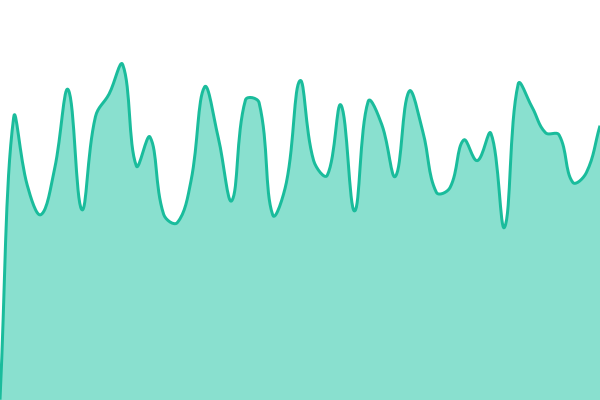
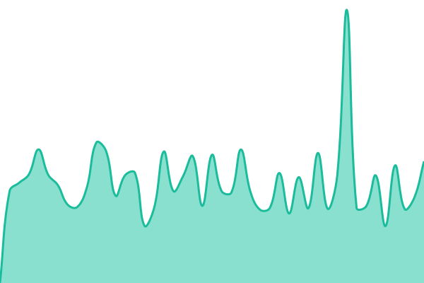
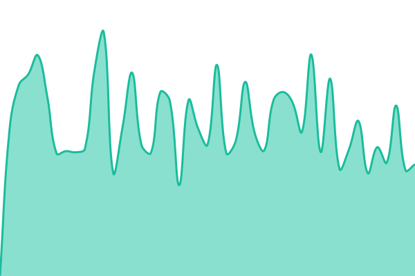
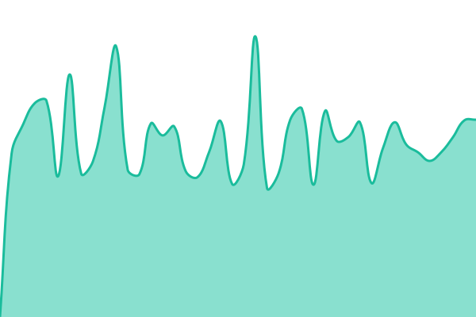
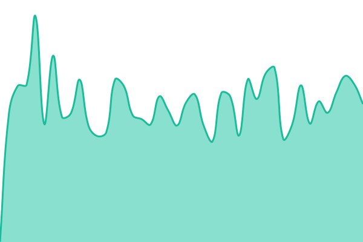

# Доступность сервисов Zolotenkov

Публичная страница: **https://status.zolotenkov.ru**

Здесь несколько раз в час автоматически проверяется, отвечают ли снаружи рабочее
место МРП, его серверная часть и база, сайт и справка. Результат каждой проверки
попадает в этот репозиторий, и в него же — история за всё время наблюдения.
Переписать её задним числом нельзя: это обычные коммиты git.

Проверки выполняет расписание GitHub Actions, страницу отдаёт GitHub Pages.
Своего сервера у страницы нет намеренно: она обязана остаться на связи ровно
тогда, когда лежит наш собственный узел.

<!--start: status pages-->
<!-- This summary is generated by Upptime (https://github.com/upptime/upptime) -->
<!-- Do not edit this manually, your changes will be overwritten -->
<!-- prettier-ignore -->
| URL | Status | History | Response Time | Uptime |
| --- | ------ | ------- | ------------- | ------ |
|  [Рабочее место МРП](https://mrp.zolotenkov.ru/) | Работает | [mrp.yml](https://github.com/zorizavod/status/commits/HEAD/history/mrp.yml) | 

 765мс
     
 | 

<a href="https://status.zolotenkov.ru/history/mrp">100.00%</a>
    

|  [Серверная часть](https://mrp.zolotenkov.ru/api/health) | Работает | [api.yml](https://github.com/zorizavod/status/commits/HEAD/history/api.yml) | 

 726мс
     
 | 

<a href="https://status.zolotenkov.ru/history/api">100.00%</a>
    

|  [База данных](https://mrp.zolotenkov.ru/api/health) | Работает | [database.yml](https://github.com/zorizavod/status/commits/HEAD/history/database.yml) | 

 701мс
     
 | 

<a href="https://status.zolotenkov.ru/history/database">100.00%</a>
    

|  [Сайт](https://zolotenkov.ru/) | Работает | [website.yml](https://github.com/zorizavod/status/commits/HEAD/history/website.yml) | 

 1368мс
     
 | 

<a href="https://status.zolotenkov.ru/history/website">100.00%</a>
    

|  [Справка](https://support.zolotenkov.ru/) | Работает | [docs.yml](https://github.com/zorizavod/status/commits/HEAD/history/docs.yml) | 

 904мс
     
 | 

<a href="https://status.zolotenkov.ru/history/docs">100.00%</a>
    

<!--end: status pages-->

## Как заводится сообщение об аварии

Авария — это issue в этом репозитории. Она появляется на публичной странице
сразу, поэтому текст пишется для покупателя, а не для нас: что не работает, с
какого времени, что делаем и когда ждать следующего сообщения. Внутренние
адреса, имена контейнеров, версии и тексты ошибок наружу не идут.

## Настройка

Всё описано в [`.upptimerc.yml`](./.upptimerc.yml): список проверок, признаки
«жив» и все тексты страницы по-русски.

Собрано на [Upptime](https://upptime.js.org), лицензия MIT.
